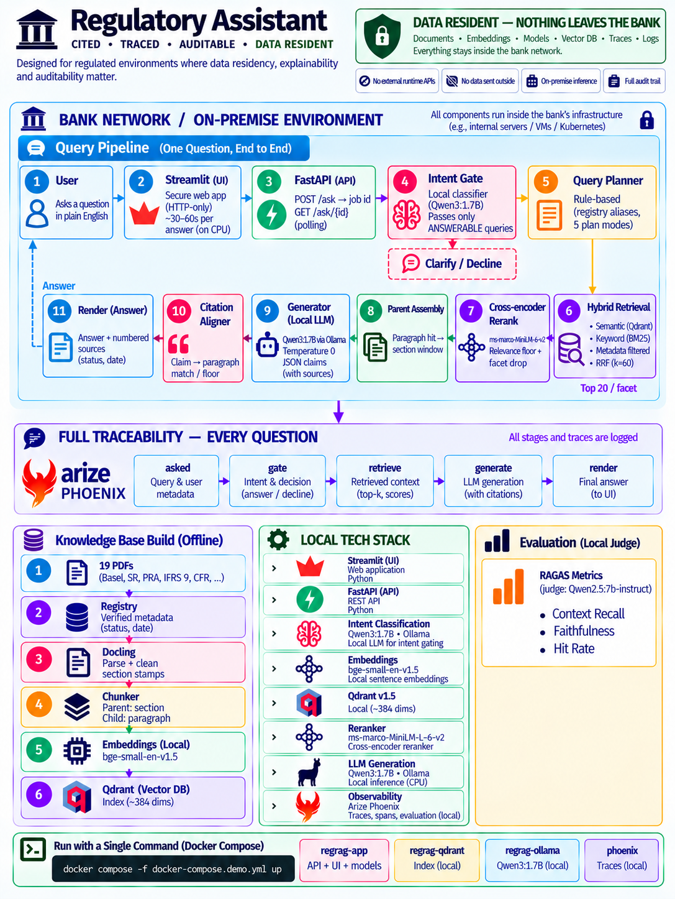

# RegRAG — a Regulatory Assistant for Credit Risk

Ask a question about the rules that govern credit risk and model risk. RegRAG answers from 19 regulatory documents (Basel, SR 11-7 / SR 26-2, PRA SS1/23, IFRS 9, US stress-testing rules), and **every claim carries its source paragraph**.

It runs **entirely on your own machine**: the language model, the search index, the tracing. No question and no document leaves it.



---

## Why this matters to a bank

| | What it means here |
|---|---|
| **Data residency** | The model (qwen3:1.7b via Ollama), embeddings, reranker, vector store and trace viewer all run locally. The app makes no calls to an outside model; Hugging Face is set to offline at runtime. Nothing leaves the bank's systems. |
| **Auditability** | Every answer cites the exact paragraph it came from, with the document's status (in force / superseded) and effective date. Every question is traced step by step in Arize Phoenix and written to an audit log. |
| **Built for the hardest documents** | Regulatory texts nest 3–4 levels deep (section → paragraph → sub-point → footnote). A pipeline that handles these handles other banking documents — credit policies, procedure manuals, model documentation. |
| **One-command deployment** | `docker compose up` starts the whole stack with the index and model already inside the images. |

---

## Quick start

You need Docker (Docker Desktop on Windows/Mac). Then:

```bash
git clone https://github.com/anujagarwal-git/AI-Portfolio.git
cd AI-Portfolio/RAG
docker compose -f docker-compose.demo.yml up
```

Open **http://localhost:8501** and ask a question.

| Port | Service |
|---|---|
| 8501 | Streamlit UI |
| 8000 | FastAPI (`POST /ask`, `GET /ask/{id}`, `GET /health`) |
| 6006 | Arize Phoenix — the trace of every question |

**First run downloads ~7.5 GB** (app ~1.5 GB, Ollama + model ~5 GB, Qdrant + index ~0.6 GB, Phoenix ~0.4 GB). Nothing is built on your machine; the images come ready from `ghcr.io/anujagarwal-git`.

Try:
- *Under Basel LEX, when is an exposure defined as a large exposure?*
- *Under BCBS d403, what criteria must be met before a non-performing exposure can be recategorised as performing?*
- *What are the three core elements of validation under SR 11-7 and what does each involve?*

---

## The corpus — why regulatory documents

The assistant is scoped to the credit risk domain, and the documents were chosen for it:

| Area | Documents |
|---|---|
| Capital adequacy | Basel CAP, RBC, CRE, LEX, SCO, SRP32 |
| Model risk | SR 11-7 (superseded), SR 26-2, PRA SS1/23 |
| Credit impairment & problem assets | IFRS 9 (credit risk extract), BCBS d403 |
| Data quality | BCBS 239 |
| Stress testing | BCBS d450, 12 CFR 225.8, 12 CFR Part 252, SR 15-18, SR 15-19, 2026 Fed scenarios, 2026 DFAST results |

Every document is described in a **registry** (`data/registry.yaml`) — jurisdiction, issuer, status, effective date, document type. These facts are curated by hand, never guessed by a parser, and the indexer refuses any row not marked verified. They travel with every chunk, which is what lets the assistant say *"SR 11-7 (superseded; eff. 2011-04-04)"* instead of quoting an old rule as current.

Regulatory text is a deliberate stress test: deep nesting, cross-references, defined terms, and near-identical wording across regulators. Chunking follows the document's own structure — a **paragraph** is retrieved, and its parent **section** is what the model reads.

---

## Architecture

| Stage | What it does | Tool |
|---|---|---|
| Parse | PDF → structured text with section stamps | Docling |
| Chunk | Parent = section, child = paragraph | custom chunker (`regrag/ingestion/`) |
| Embed | 384-dim vectors | `BAAI/bge-small-en-v1.5` |
| Index | Vectors + registry metadata on every chunk | Qdrant |
| Gate | Sorts the question: answerable / incomplete / out of domain / out of corpus | qwen3:1.7b |
| Plan | Rule-based: which documents, which jurisdictions, old vs new version | `regrag/retrieval/planner.py` |
| Retrieve | Per document: dense (metadata-filtered) + BM25, fused with RRF (k=60) | Qdrant, rank-bm25 |
| Rerank | Cross-encoder reorders, a relevance floor drops weak hits | `cross-encoder/ms-marco-MiniLM-L-6-v2` |
| Generate | Answer as JSON claims, temperature 0, fixed seed | qwen3:1.7b via Ollama |
| Cite | Each claim aligned back to the paragraph that supports it | `regrag/generation/align.py` |
| Serve | Async job API + UI that talks to it only over HTTP | FastAPI, Streamlit |
| Observe | Spans: ask · gate · answer · retrieve · render · generate | Arize Phoenix (OpenInference) |
| Evaluate | Context recall, faithfulness, citation accuracy | RAGAS, local judge `qwen2.5:7b-instruct` |

Why these choices: small models because it must run on a CPU inside the bank's perimeter; temperature 0 and a fixed seed so two evaluation runs can be compared; a rule-based planner because the same question must take the same path every time. The production upgrade path is clear — a stronger embedding model (e.g. BGE-M3) and a larger LLM on a GPU, same pipeline.

---

## Auditability in practice

**Citations.** An answer ends with numbered sources:

```
SOURCES [1] Basel LEX, LEX20.1 (in_force; eff. 2019-12-15)
        [2] SR 11-7, Key Elements of Comprehensive Validation (superseded; eff. 2011-04-04)
```

**Traces.** Open http://localhost:6006 — each question shows the gate decision, the retrieval plan, every passage retrieved with its scores, the prompt, and the generation time.

**Audit log.** `logs/regrag.jsonl` records, per question: the question, gate decision, retrieval mode and documents, citations, timings per stage, and a config hash (model, prompt version, temperature, thresholds) so any answer can be tied to the exact configuration that produced it.

---

## Results

Measured on a golden set written from the source documents (`evaluation/golden_set_v2.jsonl`). Judge: `qwen2.5:7b-instruct`, local, temperature 0. Generator: `qwen3:1.7b`.

| Metric (40 questions) | Original wording | Specific wording |
|---|---|---|
| RAGAS context recall | 0.829 | **0.910** |
| RAGAS faithfulness | 0.894 | **0.894** |

**Hit rate** (at least one relevant passage retrieved): **96%**.

**Citation accuracy** (104 claims): every claim carries a source label and every label is valid — **104/104**; the cited paragraph was in the text the model was given — **103/104**.

**What changed between the two columns.** Six questions were worded generically — for example *"the earlier US guidance"* instead of *"SR 11-7"*, or *"their principal quantitative limit"* instead of naming the ratios. They were rewritten to name the document and the item asked for (one was split in two, giving seven), and re-run (`evaluation/golden_specific.jsonl`). Context recall rose from 0.829 to 0.910; faithfulness held at 0.894. The lesson for users: name the regulation and the item, and retrieval improves.

**Not considered in these scores.** Eight questions that test the two known weaknesses — cross-section (gs-18, 26, 46, 48) and cross-jurisdiction (gs-08, 09, 34, 35) — are kept in the golden set but excluded from the scores above. See *Known limitations*.

Run files: `evaluation/runs/ragas/golden_run_20260916T150216Z_combined.json` (original and reworded questions side by side), `evaluation/runs/citation/`.

---

## Performance

About **30–60 seconds per answer** on an Intel Core i7-1185G7 laptop CPU with 32 GB RAM and no GPU. Almost all of that is the language model reading the retrieved passages and writing the answer on CPU. This is the price of data residency on a laptop; on a GPU-backed inference server (vLLM, TGI or similar) the same pipeline would answer in seconds.

---

## Known limitations

These are documented, not hidden — the UI shows the first three in its sidebar.

- **Cross-section questions.** If the answer spans several sections of one document, only the sections retrieved are used.
- **Cross-jurisdiction questions.** The model can blend rules from two regulators into one statement.
- **Speed.** 30–60 s per answer on CPU (see above).
- **Vague wording.** Questions that don't name the document or the specific item retrieve less precisely.
- **Chunker edge case.** A sub-point like "(a)" directly after a section header can start a new parent section. Left as is: changing parent boundaries forces a full re-index.

---

## Run from source (developers)

```bash
uv sync                                   # Python 3.12+
docker compose up -d                      # Qdrant + Phoenix
ollama pull qwen3:1.7b                    # Ollama running locally
$env:REGRAG_TRACE=1                       # PowerShell; optional tracing
uv run uvicorn api.main:app --port 8000
uv run streamlit run ui/streamlit_app.py
```

Evaluation:

```bash
uv run python scripts/run_golden.py --metrics both --save
uv run python scripts/citation_accuracy.py --save
```

Rebuild and push the images:

```bash
docker compose -f docker-compose.demo.yml -f docker-compose.build.yml build
docker compose -f docker-compose.demo.yml -f docker-compose.build.yml push
```

---

## Repository layout

```
RAG/
├── regrag/                 the pipeline
│   ├── ingestion/          parser · sections · clean · chunker
│   ├── index/              embedder · vector_store
│   ├── gate/               intent gate
│   ├── retrieval/          planner · search · reranker
│   ├── generation/         prompts · llm · answer · align · render
│   ├── observability/      tracing · audit log
│   ├── evaluation/         judge
│   ├── registry.py         document registry loader (the verified gate)
│   └── config.py           every tunable value, in one place
├── api/main.py             FastAPI
├── ui/streamlit_app.py     Streamlit (HTTP only)
├── prompts/                versioned prompt files
├── data/registry.yaml      curated document metadata
├── evaluation/             golden sets and run results
├── scripts/                ask · run_golden · citation_accuracy · …
├── tests/                  pytest suite
├── docker/                 Qdrant and Ollama image definitions
├── Dockerfile              app image (api + ui)
└── docker-compose*.yml     dev · demo · build
```
